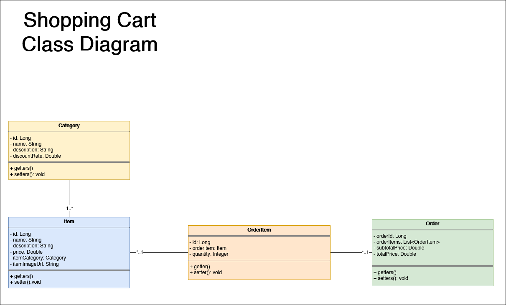
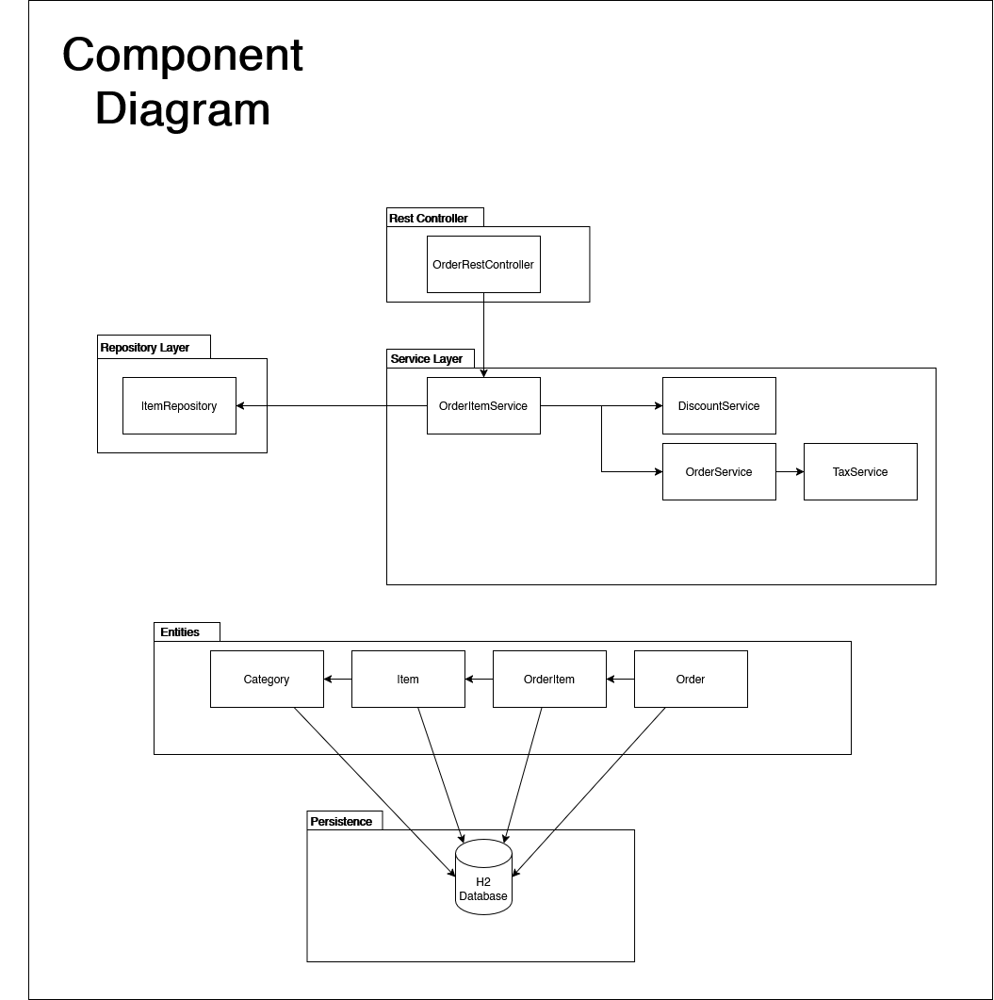
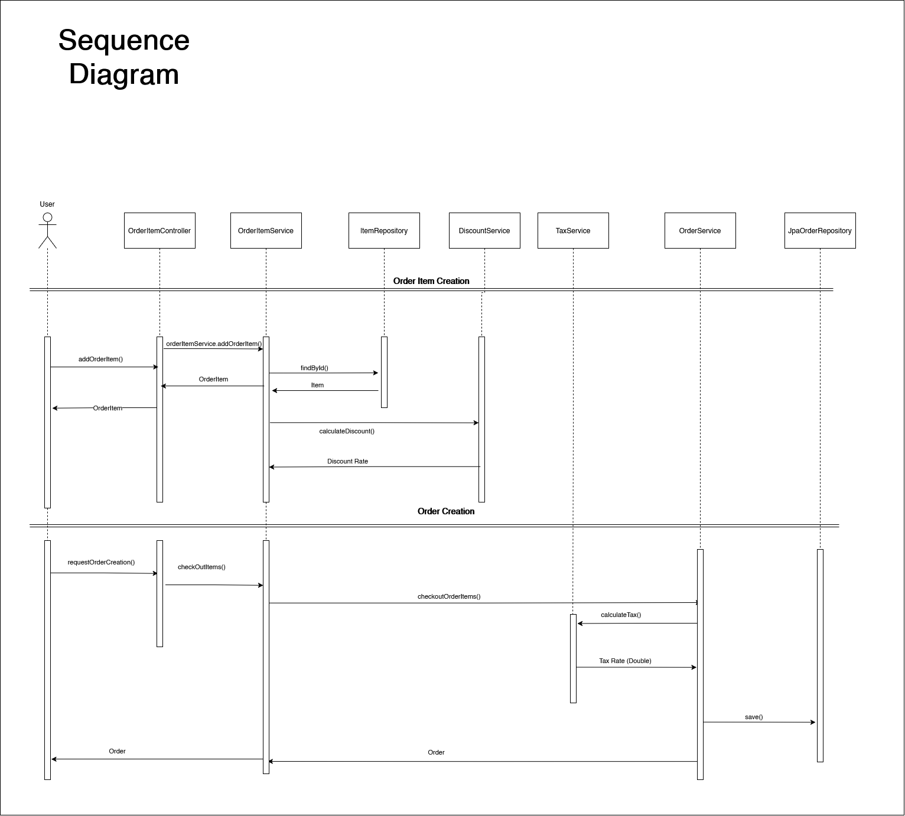

# Highspring-Shopping-Cart-App

Spring Boot Backend for Shopping Cart web aplication, calculates purchase quantities, discounts, subtotal and total prices for different products

## Instructions

User input of orders through UI is currently not supported, all the available items are preloaded in an H2 database, orders can be placed through public use endpoints, more info about the API in the swagger documentation:

> localhost:8080/swagger-ui/index.html#/

Once the orders are loaded the rest of the program functionalities such as performing an order, checkout and clearing a shopping cart can be done through the UI.

H2 database can be consulted at:

> localhost:8080/h2-console

## Architecture diagrams

### Class Diagram

### Component Diagram

### Sequence Diagram

## Documentation

All the oficial Javadoc documentation can be found at:
[View Javadoc](https://kelpielw.github.io/Highspring-Shopping-Cart-App/)
